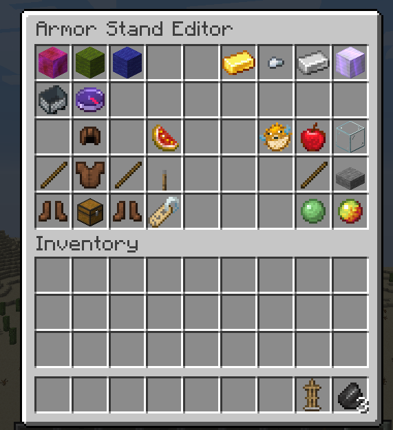

# Armor Stand Editor

Another mod the server has is [Patbox's](https://github.com/Patbox) Armor Stand Editor mod, which allows any player to customize poses, actions, and more for your armor stands!

To use this feature, click with flint in your hand anywhere to select action you want to perform. After doing so, click on armor stand to apply it. It's simple as that!

